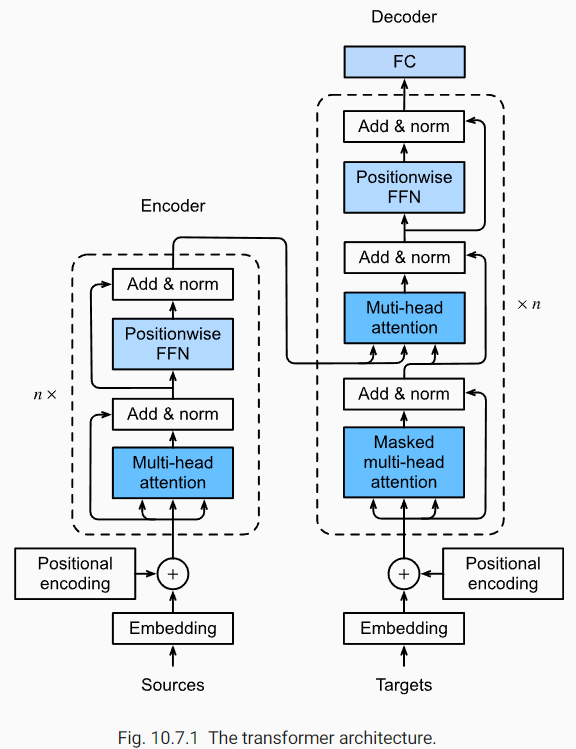
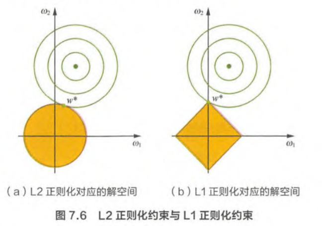
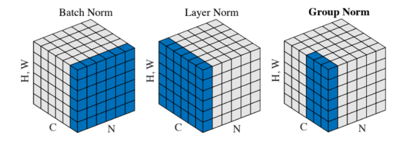
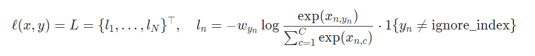
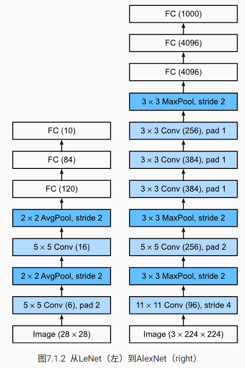
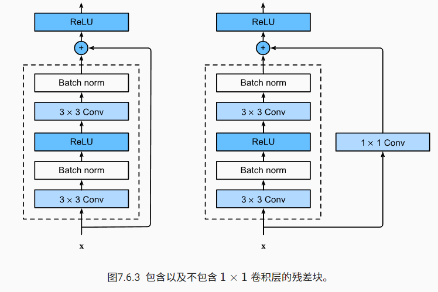

## 算法面经（含解答）

把自己看到的一些面经做一个汇总，面试其实能够考虑到的深度是不太够的，但是有相当的广度，记住一些结论会很有帮助。虽然整理得非常简洁，但是面试的时候尽量展开！

注意：解答一般不会深入分析，并且也没有总结机器学习相关内容

### Transformer

一句话理解 attention 机制：给定 context data key value pair，给定 query，给定 query 与 context 的交互方式（即 attention score & attention pooling function），就能输出预测结果。可以用回归的模型去套一下，会更好理解

#### 缩放点积注意力

$$
a(\mathbf{q}, \mathbf{k})=\mathbf{q}^{\top} \mathbf{k} / \sqrt{d}
$$

这就是 transformer 里用到的注意力机制

假设查询和键的所有元素都是独立的随机变量， 并且都满足零均值和单位方差， 那么两个向量的点积的均值为0，方差为 d。为确保无论向量长度如何，点积的方差在不考虑向量长度的情况下仍然是1，我们将点积除以 $\sqrt d$

如果是 key query 维度不同的情况，可以使用加性注意力

#### 多头注意力

当给定相同的查询、键和值的集合时， 我们希望模型可以**基于相同的注意力机制学习到不同的行为**，然后将不同的行为作为知识组合起来
$$
\mathbf{h}_{i}=f\left(\mathbf{W}_{i}^{(q)} \mathbf{q}, \mathbf{W}_{i}^{(k)} \mathbf{k}, \mathbf{W}_{i}^{(v)} \mathbf{v}\right) \in \mathbb{R}^{p_{v}}
\\
\mathbf{W}_{o}\left[\begin{array}{c}
\mathbf{h}_{1} \\
\vdots \\
\mathbf{h}_{h}
\end{array}\right] \in \mathbb{R}^{p_{o}}
$$

#### 位置编码

自注意力计算结果是不包含位置（顺序）信息的，我们可以自己加上
$$
\begin{aligned}
p_{i, 2 j} &=\sin \left(\frac{i}{10000^{2 j / d}}\right) \\
p_{i, 2 j+1} &=\cos \left(\frac{i}{10000^{2 j / d}}\right)
\end{aligned}
$$

#### Transformer block

只能看个大概，每个结构都是非常重要的设计：

1. multi-head attention
2. add & norm
3. residual connection
4. MLP



### NMS

#### 代码实现

要点：1. 将选框排序，使用该 index 作为索引，顺序筛选；2. 计算 IoU；3. 排除选框

```python
def nms(boxes, score, thresh):
    """
    NMS scripts based on numpy.
    Params:
        - data: (N, 5)
        - thresh: float
        - score: (N,)
    """
    lt = boxes[:, :2]
    rb = boxes[:, 2:]
    area = np.prod(rb - lt, axis=1)
    index = np.argsort(score)
    keep = []
    while len(index) > 0:
        cur_i = index[0]
        cur_box = boxes[cur_i]
        keep.append(cur_box)

        lt_inter = np.maximum(cur_box[:2], boxes[index, :2])
        rb_inter = np.minimum(cur_box[2:], boxes[index, 2:])
        wh_inter = np.maximum(rb_inter - lb_inter, 0)
        inter_area = np.prod(wh_inter, axis=1)

        iou = inter_area / (area[cur_i] + area[index] - inter_area)
        index = index[iou < thresh]
    return np.stack(keep, axis=0)
```

#### NMS 的缺陷

1. 将相邻的分数框强制删除，如果一个物体出现在重叠区域将导致物体的检测失败
2. NMS 阈值不易确定，过小会误删，过大会误检
3. NMS 并行度很低

缺点1的改进方法：

1. soft nms，不直接删除框，而是降低重叠选框的得分
1. [Fast NMS](https://blog.csdn.net/qq_36530992/article/details/103069285) 加速
1. score 可以使用 IoU 值进行矫正，获得更好的评估

### 数据

#### 数据不足

数据不足可能导致模型过拟合，可以使用如下方法

1. 数据增强：旋转，翻转，缩放，平移，噪声，颜色，剪裁
2. 正则化方法（具体方法在后面）

真正解决数据不足的方法可能只有自监督学习

#### 类别不均衡应该怎么处理

进行均衡（重）采样，或者对损失函数权重进行调整

#### 特征维度大

使用降维方法：PCA 主成分分析，或者使用 embedding 矩阵，把高维向量转化到低维向量

#### 特征归一化

消除量纲影响，控制数值分布范围，可以避免 zigzag 震荡优化

### 过拟合 欠拟合 正则化

#### 过拟合

1. 数据增强
2. 降低模型复杂度
3. 正则化方法

#### 欠拟合

1. 添加新特征
2. 增加模型复杂度
3. 减小正则化系数

#### 正则化方法

1. L1 & L2

   1. L1 正则化会导致学到的参数稀疏，L2 正则化会让学到的参数分布更均匀。可以用下图中的优化理论解释
      $$
      min \ f(x)\\
      s.t. \ m(x) \le 0
      $$
      上面的优化问题（不严谨地）等价于 $min \ f(x) + \lambda m(x)$

      

      而 L1 正则项约束的解空间是多边形。显然，多边形的解空间更容易在尖角处与等高线碰撞出稀疏解

   2. L2 正则化与权重衰减等价

2. Dropout，有了 BatchNorm 过后就不太需要了

3. BatchNorm，使用了小批量中的均值和方差，相当于在小批量中引入了噪声，有一定的正则化效果

4. 一致性正则化（半监督学习），使用 consistency loss

### BatchNorm & LayerNorm

#### BatchNorm

BatchNorm 在训练时的过程很简单，使用下面的公式描述即可
$$
\mathrm{BN}(\mathbf{x})=\gamma \odot \frac{\mathbf{x}-\hat{\boldsymbol{\mu}}_{\mathcal{B}}}{\hat{\boldsymbol{\sigma}}_{\mathcal{B}}}+\boldsymbol{\beta}
\\
\begin{aligned}
\hat{\boldsymbol{\mu}}_{\mathcal{B}} &=\frac{1}{|\mathcal{B}|} \sum_{\mathbf{x} \in \mathcal{B}} \mathbf{x} \\
\hat{\boldsymbol{\sigma}}_{\mathcal{B}}^{2} &=\frac{1}{|\mathcal{B}|} \sum_{\mathbf{x} \in \mathcal{B}}\left(\mathbf{x}-\hat{\boldsymbol{\mu}}_{\mathcal{B}}\right)^{2}+\epsilon
\end{aligned}
$$
在测试时均值使用的是训练时候的指数移动平均

具体过程可以看下面的代码，更加清晰

```python
import torch
from torch import nn


def batch_norm(X, gamma, beta, moving_mean, moving_var, eps, momentum):
    # 通过 `is_grad_enabled` 来判断当前模式是训练模式还是预测模式
    if not torch.is_grad_enabled():
        # 如果是在预测模式下，直接使用传入的移动平均所得的均值和方差
        X_hat = (X - moving_mean) / torch.sqrt(moving_var + eps)
    else:
        assert len(X.shape) in (2, 4)
        if len(X.shape) == 2:
            # 使用全连接层的情况，计算特征维上的均值和方差
            mean = X.mean(dim=0)
            var = ((X - mean) ** 2).mean(dim=0)
        else:
            # 使用二维卷积层的情况，计算通道维上（axis=1）的均值和方差。
            # 这里我们需要保持X的形状以便后面可以做广播运算
            mean = X.mean(dim=(0, 2, 3), keepdim=True)
            var = ((X - mean) ** 2).mean(dim=(0, 2, 3), keepdim=True)
        # 训练模式下，用当前的均值和方差做标准化
        X_hat = (X - mean) / torch.sqrt(var + eps)
        # 更新移动平均的均值和方差
        moving_mean = momentum * moving_mean + (1.0 - momentum) * mean
        moving_var = momentum * moving_var + (1.0 - momentum) * var
    Y = gamma * X_hat + beta  # 缩放和移位
    return Y, moving_mean.data, moving_var.data
```

BatchNorm 中可学习的参数只有 $\gamma, \beta \in \mathbb R^{C}$

BatchNorm 在部署时可以和前一层的卷积进行合并可以减少计算（重参数化技术）

BatchNorm 的作用可以总结为如下几点：

1. 固定小批量中的均值和方差 --> 维护数值的相对稳定 --> 缓解梯度爆炸/消失 --> 加速收敛（但通常不增加模型准度）
2. 固定小批量中的均值和方差 --> 引入了小批量内噪声 --> 正则化

#### LayNorm

直接搬上来这个图，瞬间理解这些 Norm 的形式（还缺了一个 instance norm，就是横着一根儿）



这些 normalization 本质上都是想要控制数值的稳定性，而 layer norm 更适合与样本之间形状不同的情况，在 NLP 领域中很常见

### 混淆矩阵与 PR 曲线

混淆矩阵是用来总结一个分类器结果的矩阵。对于k元分类，其实它就是一个k x k的表格，用来记录分类器的预测结果。对于最常见的二元分类来说，它的混淆矩阵是2乘2的

|                     | Positive | Negative |
| ------------------- | -------- | -------- |
| Prediction Positive | TP       | FP       |
| Prediction Negative | FN       | TN       |

二元混淆矩阵可以用于计算精确率和召回率帮助分析模型
$$
\begin{array}{c}
\text { Accuracy }=\frac{T P+T N}{T P+F P+T N+F N} \\
\text { Precision }=\frac{T P}{T P+F P} \\
\text { Recall }=\frac{T P}{T P+F N}
\end{array}
$$
既然提到了精确率 Precision 和召回率 Recall，避不开就要谈到 PR 曲线：以Recall为横轴，Precision为纵轴，就可以画出一条PR曲线，PR曲线下的面积就定义为AP。PR 曲线上的一个点代表着，在某一个阈值下，模型将大于该阈值的结果判定为正样本，小于该阈值的结果判定为负样本，此时返回结果对应的召回率和精确率

即 PR 曲线可由不同阈值下的混淆矩阵绘制而成，使用这样的评估模型用于表示模型对精确率和召回率的权衡

### 模型压缩和加速

[zhihu](https://zhuanlan.zhihu.com/p/138059904) 从来没处理过...只能捡点的套话整理一下

1. **矩阵分解，分组卷积，小卷积核**等计算量都是相对较少的，矩阵分解可以认为是一种降维手段

2. **权值共享**也能减低参数数量

3. 全局池化替代全连接层

4. **模型量化和剪枝**（不懂），量化是指将信号的连续取值近似为有限多个离散值的过程，可理解成一种信息压缩的方法。剪枝的总体思想是，将权重矩阵中不重要的参数设置为0，结合稀疏矩阵来进行存储和计算

5. 重参数化，将 Conv 和 BatchNorm 合成起来，参考 [zhihu](https://zhuanlan.zhihu.com/p/110552861)，简单以某一个 channel 为例，其他 channel 可以通过广播扩展
   $$
   \text{BatchNorm can be noted  as:}\\\hat x = W_{BN}·x+b_{BN}
   \\\\
   \text{Conbined with conv:}\\\hat{\mathbf{f}}_{i, j}=\mathbf{W}_{B N} \cdot\left(\mathbf{W}_{\text {conv }} \cdot \mathbf{f}_{i, j}+\mathbf{b}_{\text {conv }}\right)+\mathbf{b}_{B N}
   $$
   把上式子展开再融合，就能够获得和之前等效的参数

6. **模型蒸馏**：大模型生成 soft target 训练小模型

### 损失函数

#### Cross Entropy

交叉熵损失，形式如下：



为什么分类任务可以使用交叉熵损失，而不使用 MSE？这个问题可以从梯度的角度来回答，也可以从线性回归条件下的凸优化角度来回答：

1. 梯度角度：MSE 的梯度会包含 sigmoid 函数的求导，该求导在自变量比较大时会出现梯度消失的问题，而 CE 则不会，梯度仅与预测和标签相关
2. 凸优化角度：线性规划条件下使用 MSE 会变成非凸优化，而使用 CE 则是凸优化

使用 softmax or sigmoid 函数时需要解决上下溢问题，通常直接使用 logit 作为输入，将 softmax 和 log 一起计算就能同时解决上下溢问题
$$
\log \left(\frac{\exp (x-a)}{\sum_{i=1}^{k} \exp _{i}^{(x-a)}}\right)=\log \left(e^{(x-a)}\right)-\log \left(\sum_{i=1}^{k} \exp _{i}^{(x-a)}\right)=(x-a)-\log \left(\sum_{i=1}^{k} \exp _{i}^{(x-a)}\right)
$$

#### Focal Loss

关于 focal loss 可以看这篇 [知乎](https://zhuanlan.zhihu.com/p/80594704)，公式如下：
$$
F L=\left\{\begin{array}{rll}
-\alpha(1-p)^{\gamma} \log (p), & \text { if } & y=1 \\
-(1-\alpha) p^{\gamma} \log (1-p), & \text { if } & y=0
\end{array}\right.
$$
白话来说：focal loss 使用了两个技巧改变 loss function 的分布：

1. alpha 可以调节正负样本 loss 分布 
2. gamma 可以条件难易样本 loss 分布

这样我们就能够平衡难易样本和正负样本之间的 loss，把优化重点放到更难的样本之上，加速优化。上面知乎中的有一条评论也解决了我的疑惑，为什么正样本远小于负样本时 alpha 还取得较小：因为 gamma 的效应太大了，反而需要提升一点负样本的比重。总之就是实践出来的！

#### KL Divergence & CE

[zhihu](https://zhuanlan.zhihu.com/p/292434104) 交叉熵和 KL 散度之间的联系是什么？交叉熵就是用于衡量两个分布之间的相似度。这里又要提一句 KL 散度和交叉熵之间的关系与区别：**KL 散度可以被用于计算两个分布的差异，而在特定情况下最小化 KL 散度等价于最小化交叉熵。而交叉熵的运算更简单，所以用交叉熵来当做代价**。再贴几个公式
$$
S(v)=-\sum_{i} p\left(v_{i}\right) \log p\left(v_{i}\right)
\\
D_{K L}(A \| B)=\sum_{i} p_{A}\left(v_{i}\right) \log p_{A}\left(v_{i}\right)-p_{A}\left(v_{i}\right) \log p_{B}\left(v_{i}\right)
\\
H(A, B)=-\sum_{i} p_{A}\left(v_{i}\right) \log p_{B}\left(v_{i}\right)
\\
H(A, B)=D_{K L}(A \| B)+S_{A}
$$
当 $S_A$ 为常数时，优化交叉熵等价于优化 KL 散度。最后提一句通过 Jensen 不等式可证明 KL 散度大于0

#### Smooth L1

Smooth L1的优点：1. 处理了 L1 的不光滑；2. 处理了 L2 对于离群点惩罚过大

#### IoU Loss

独立回归 $(x, y, z, w, h, l, \theta)$ 会存在如下问题 [zhihu](https://zhuanlan.zhihu.com/p/380016283)：

1. **参数独立优化使得我们需要根据不同的数据集特点进行权重的调整**。比如大长宽比目标可能需要着重关注角度参数，小目标则需要关注中心点参数，因为这些参数的轻微偏移都会造成这些目标预测精准度（IoU）的急剧下降
2. **损失和评估不一致**

IoU Loss：DIoU, GIoU, CIoU  [zhihu](https://zhuanlan.zhihu.com/p/94799295)，单纯使用 IoU 作为损失函数的优点：**能够真实评价归回质量，并且具有尺度不变性**

缺点：

1. 不能反映两者的距离
2. 不能反映非重合区域的情况
3. 收敛慢，可能有不可导的情况出现

为改善上面的两个缺点，提出 GIoU
$$
G I o U=I o U-\frac{\left|A_{c}-U\right|}{\left|A_{c}\right|}
$$
其中 $A_c$ 表示两个框的最大闭包，$U$ 则表示两个框的联合面积，如果两个选框距离比较远，并且非重叠区域很大的话，GIoU 就能反映出来。之后又提出了 DIoU
$$
D I o U=I o U-\frac{\rho^{2}\left(b, b^{g t}\right)}{c^{2}}
$$
其中 $c$ 是最大闭包的对角线，$\rho$ 是欧式距离计算公式，$b, b^{gt}$ 代表框的中心。DIoU 损失比 GIoU 损失收敛得更快，也更直观

之后又提出了另外一个 CIoU，进一步考虑长宽比，这里不做进一步整理了

### 优化

#### Adam & AdamW

Adam 要将 RMSProp 和 Momentum 结合起来，其实二者一个是对方向的平滑/平均（可从动量角度解释），另一个是对模的平滑/平均（避免 zigzag 更新）
$$
\begin{array}{l}
\mathbf{v}_{t} \leftarrow \beta_{1} \mathbf{v}_{t-1}+\left(1-\beta_{1}\right) \mathbf{g}_{t} \\
\mathbf{s}_{t} \leftarrow \beta_{2} \mathbf{s}_{t-1}+\left(1-\beta_{2}\right) \mathbf{g}_{t}^{2}
\end{array}
$$
我们同时更新动量/一阶矩 $v_t$ 和二阶矩 $s_t$（随机变量 x 的 n 阶矩为 $E[x^n]$）。当 t 比较小的时候，一阶矩和二阶矩会与其估计出现较大的偏差，在更新通过以下式子进行修正
$$
\hat{\mathbf{v}}_{t}=\frac{\mathbf{v}_{t}}{1-\beta_{1}^{t}} \text { and } \hat{\mathbf{s}}_{t}=\frac{\mathbf{s}_{t}}{1-\beta_{2}^{t}}
$$
最后更新参数，注意 ε 是在根号外面的，与 RMSProp 不同，在实践中效果略好，深层原因不明...
$$
\mathbf{g}_{t}^{\prime}=\frac{\eta \hat{\mathbf{v}}_{t}}{\sqrt{\hat{\mathbf{s}}_{t}}+\epsilon}
\\
\mathbf{x}_{t} \leftarrow \mathbf{x}_{t-1}-\eta_{t} \mathbf{g}_{t}^{\prime}
$$
[AdamW pytorch](https://pytorch.org/docs/stable/generated/torch.optim.AdamW.html) 区别于 [Adam pytorch](https://pytorch.org/docs/stable/generated/torch.optim.Adam.html#torch.optim.Adam)，其实很简单，[AdamW](https://paperswithcode.com/method/adamw) 就是把 weight decay 从 EMA 当中分离出来，放到最后去更新梯度，从而不让 EMA 受到 weight decay 的影响

#### 梯度爆炸与消失

1. 出现了很多神经元为0的情况，为什么？原因在于会有一种情况：梯度太大，学习率也大，导致权重更新幅度很大，导致对于任意训练样本，网络的输出都是小于0的，这样神经元是在 ReLU 激活函数后是不会更新的。可以使用 LeakyReLU，缓解这样的情况
2. 梯度消失。上面的情况也属于梯度消失，还有其他原因也经常导致梯度消失：
   1. 网络太深，权重连续相乘，梯度迅速衰减
   2. 损失函数 or 激活函数区域饱和，例如 sigmoid 激活函数
3. 梯度爆炸。也主要有两个原因：
   1. 网络太深，权重连续相乘，梯度迅速攀升
   2. 权值初始化太大，或者学习率太大

解决方法：

1. 使用**更好的激活函数**，例如 ReLU 替代 sigmoid，可以避免部分梯度消失的情况
2. **梯度裁剪**可减缓梯度爆炸的情况
3. **正则化**方法也能够减缓梯度爆炸的情况：L1, L2, BatchNorm 都能够一定程度控制参数/训练数值的范围
4. **残差连接**捷径，能够让梯度跳过网络直接回传
5. LSTM 门控结构

### Python

#### 迭代器 生成器 yield

[bilibili](https://www.bilibili.com/video/BV1ca411t7A9) 可迭代对象能够帮助我们方便地逐个地访问一个序列，可迭代对象随处可见（list, tuple, dict）。一个类拥有 `__iter__` 方法，代表它的对象是可迭代对象，该方法返回值通常是 self 本身。个人认为，该方法是一个可迭代标志，有的地方强制要求拥有该标志，例如循环。通常在 `__iter__` 方法里写一些初始化代码，每次调用 `__iter__` 的时候就“序列的“指针”就会被“拨到初始位置”（引号表示比喻，之后将沿用）

通过内置函数 `iter` 就可以显式调用该对象的 `__iter__` 方法。不过我们通常在好的封装中没有看到显式地使用 `iter` 方法，例如循环

`__iter__` 相当于做一个初始化，真正的逐个访问序列需要使用另一个方法 `__next__`。每次使用 `__next__` 方法，序列的指针就会往前走一步，直到序列结束位置。可以使用 `next` 方法显式调用对象的 `__next__` 方法

```python
class Test:
    def __init__(self, n):
        self.n = n
        self.count = 0

    def __iter__(self): 
        self.count = 0
        return self

    def __next__(self):
        if self.count < self.n:
            self.count += 1
            return self.count - 1
        else:
            raise StopIteration

t = Test(3)
b = next(t) # can work without __iter__ function
# 0
c = next(t)
# 1

for i in t: # require it as iterable
    print(i)
# 0 1 2
```

虽然 `__next__` 也可以独立于 `__iter__` 运作，但是默认他们必须同时在一个可迭代对象里实现

而 `yield` 关键字将让一个函数变为可迭代对象，但是由于没有 `__iter__` 方法初始化，不能重复迭代，相当于快速实现的一次性可迭代对象。`next` 方法将不断地去 return `yield` 后面的值，直到没有 `yield`

```python
def test(n):
    count = 0
    while count < n:
        yield count
        count += 1

for i in test(3):
    print(i)
# 0 1 2
for i in a:
    print(i)
# no more
```

#### 装饰器

[闭包](https://www.bilibili.com/video/BV1M7411a7M3)：在一个内部函数中，**对外部作用域的变量进行引用**，(并且一般外部函数的返回值为内部函数)，那么内部函数就被认为是闭包。闭包可以避免全局变量的使用以及提供某种形式数据的隐藏

一个求和的闭包 `inner` 放到其中

```python
def average():
    l = []
    def inner(value):
        l.append(value)
        return sum(l)
    return inner

aver = average()
aver(1)	# 1
aver(2)	# 3
```

变量 `l` （也称自由变量）不会在内存中消失。这和类的属性与方法，感觉有异曲同工之妙。现在我来简单地定义一下闭包/内部函数的作用：能方便对外部变量进行引用

装饰器（我这里叫其装饰函数）就是闭包的一个应用，通常和 `@` 语法糖搭配使用。我们把 `function(*args, **kwargs)` 作为**外部变量**传入给**装饰函数** `decorate(func)`，**`@` 语法糖就是将装饰函数返回的闭包/内部函数，赋给 `function`**，即 `function = decorate(function)`

装饰函数的闭包/内部函数通常是一个简单的 `wrap(*args, **kwargs)` 函数，用于执行我们需要装饰的 `function(*args, **kwargs)` 以及“装饰”代码

```python
def decorate(func):
    var = 1
    print(f'outside var: {var}')
    def wrap(*args, **kwargs):
        print('decorator codes')
        func(*args, **kwargs)
    return wrap	# 返回闭包

@decorate
def function():
    print('this is a function')

print('--------')	# ouside var: 1 会先于此代码执行
					# 即 @decorate 会立即执行 function = decorate(function)
function()
```

实际上 `@` 语法糖和装饰器的灵活性非常强：

1. 语法糖 `@` **本质是将 `function` 作为参数输入装饰函数，并把装饰函数的返回值赋给 `function`**。这个**返回值可以是任何对象**，即：装饰函数可以不返回闭包，此时 `function = any returned object, for example: None or even itself`

2. 装饰函数，闭包，`function`，三者可以很灵活，均可以是类，均可以是类的方法

```python
def any_function(func):
    var = 1
    print(f'var: {var}')
    func()
    # return func

@any_function
def function():
    print('this is a function')
```

当我们想要用 `function` 作为外部变量，或重映射 `function` 功能时，就可以用 `@` 语法糖

#### 垃圾处理

[垃圾回收-bilibili](https://www.bilibili.com/video/BV1W4411S7mq) 这个视频讲得比较清楚，也挺形象的

1. 引用计数：这是 python 的主要回收机制，也比较好理解。就是没有变量引用该对象时，该对象就会被回收。这里还学到 `__del__` 方法就是在删除对象时调用的方法。引用计数的优点：简单且实时性高；缺点：

   1. 需要维护引用数量，消耗了很多资源（本质上无法解决）

   2. 无法删循环/嵌套引用的对象

      ```python
      a = []
      b = []
      a.append(b)
      b.append(a)
      ```

2. 标记清除 & 分代回收：这两种回收方式就是为了解决引用计数的第二个缺点。标记清除分为两个阶段：标记阶段和清除阶段，清除阶段其实就是分代回收

   1. 标记阶段：所有的活动对象是一个点，每一个对象之间的引用关系构成边，这样就能构建一个有向图
   2. 清除阶段：从根 (root) 对象出发，遍历整个图，不可达对象就是需要清理的，根对象就是全局对象，调用栈，寄存器。遍历的时机由分代回收决定：
      1. 对象分为三代 0代 1代 2代
      2. 当分配对象个数 - 释放对象个数 > 700 时，将对 0代对象进行一次遍历回收。此时未被回收的对象成为 1代对象
      3. 当进行 10 次 0代对象回收后，对 1代对象进行一次遍历回收。此时未被回收的对象成为 2代对象
      4. 当进行 10 次 1 代对象回收后，对 2代对象进行一次遍历回收

#### 多进程/多线程/多协程/GIL

[Python 并发编程-bilibili](https://www.bilibili.com/video/BV1bK411A7tV) 整理一下其中的概念，以及一些实用方法

首先提出一个问题，为什么需要并行编程？答案当然很简单，并行计算效率更高。那么多线程/多进程的并发编程有什么区别吗？给一个简洁的答案：多线程并发编程仍然受到 GIL 全局解释锁的限制，而多进程利用多核 CPU 将不受 GIL 的限制，是真正意义上的并行计算，下面简要介绍 GIL：

1. **GIL 的作用**，只能有一个线程使用 CPU 进行计算，如有其他线程必须等待该线程使用完 CPU 后 GIL 释放再执行

2. **为什么需要 GIL**，这是 python 的引用计数导致的妥协方法。如果有多个线程同时访问一个内存空间，引用计数的计算将会出错。具体来说，如果某对象的“引用计数”恰好被两个线程同时减小，该对象会因为没有被正确释放而导致**内存泄漏**

既然多线程依然受到 GIL 的限制，那还有用吗？答案是肯定的，这里介绍多线程和多进程**使用的场景：**

1. 多线程适用于 IO 密集型计算场景，如文件处理、读写数据库、网络爬虫
2. 多进程适用于 CPU 密集型计算场景，如压缩解压、加密解密、数学计算

实际使用中的注意点：

1. 通常会使用线程池/进程池 Pool 来实现多线程/多进程，使用 `concurrent` 模块

   ```python
   from concurrent.futures import ThreadPoolExecutor, ProcessPoolExecutor
   
   with ThreadPoolExcecutor(max_threads) as executor:
       results = exector.map(func, *list_of_args)
   
   with ProcessPoolExcecutor(max_threads) as executor:
       results = exector.map(func, *list_of_args)
   # if a func has 2 args func(a, b), list_of_args is like [a1, a2, ...], [b1, b2, ...]
   ```

   线程/进程池能够重复地使用线程/进程资源，从而节省资源并加快运行速度 [zhihu](https://zhuanlan.zhihu.com/p/343232126)

2. 可以使用 Lock 锁对资源加锁，保护冲突访问

3. 可以使用 Queue 实现不同进程/线程之间的通信

最后再讲一下进程/线程/协程的关系，他们是包含关系，一个进程可以开启多个线程，一个线程可以开启多个协程。并且开启一个进程/线程/协程的资源逐渐递减，所以多进程可启动数目是最少的，受到 CPU 核限制，而多线程更加轻量可启动更多的线程，多协程则更加暴力能够启动上万个协程，但是代码更加复杂，而且需要三方代码库本身支持才能启动协程

### CNN 发展史

#### AlexNet to ResNet

2012年，AlexNet 横空出世。它首次证明了学习到的特征可以超越手工设计的特征。AlexNet 使用了8层卷积神经网络，并以很大的优势赢得了2012年 ImageNet (224x224) 图像识别挑战赛



```python
import torch
from torch import nn

AlexNet = nn.Sequential(
    nn.Conv2d(1, 96, kernel_size=11, stride=4, padding=1), nn.ReLU(),
    nn.MaxPool2d(kernel_size=3, stride=2),
    # 减小卷积窗口，使用填充为2来使得输入与输出的高和宽一致，且增大输出通道数
    nn.Conv2d(96, 256, kernel_size=5, padding=2), nn.ReLU(),
    nn.MaxPool2d(kernel_size=3, stride=2),
    nn.Conv2d(256, 384, kernel_size=3, padding=1), nn.ReLU(),
    nn.Conv2d(384, 384, kernel_size=3, padding=1), nn.ReLU(),
    nn.Conv2d(384, 256, kernel_size=3, padding=1), nn.ReLU(),
    nn.MaxPool2d(kernel_size=3, stride=2),
    nn.Flatten(),
    # 这里，全连接层的输出数量是LeNet中的好几倍。使用dropout层来减轻过度拟合
    nn.Linear(6400, 4096), nn.ReLU(),
    nn.Dropout(p=0.5),
    nn.Linear(4096, 4096), nn.ReLU(),
    nn.Dropout(p=0.5),
    # 最后是输出层。由于这里使用Fashion-MNIST，所以用类别数为10，而非论文中的1000
    nn.Linear(4096, 10))
```

AlexNet和LeNet的设计理念非常相似，但也存在一些差异，除了层数更深，通道更多，其他关键的改变还有：

1. 激活函数从 sigmoid 改为 ReLU
2. 使用了 dropout 正则化
3. 使用了数据增强

加深网络一定能提升模型的表现吗？答案将会是否定的，当我们添加一条恒等映射的连接路径时，网络的优化将更容易学习恒等映射，一定程度防止了网络退化，并且梯度能够通过该连接持续传递，优化起来更容易

为了让输出和输入能够相加，显然要求输入和输出是具有相同形状和相同通道数，这个问题可以使用 1x1 卷积层解决。ResNet 中的残差块图示如下



代码将更清晰地展示其中的细节

```python
import torch
from torch import nn
from torch.nn import functional as F


class Residual(nn.Module):  #@save
    def __init__(self, input_channels, num_channels,
                 use_1x1conv=False, strides=1):
        super().__init__()
        self.conv1 = nn.Conv2d(input_channels, num_channels,
                               kernel_size=3, padding=1, stride=strides)
        self.conv2 = nn.Conv2d(num_channels, num_channels,
                               kernel_size=3, padding=1)
        if use_1x1conv:
            self.conv3 = nn.Conv2d(input_channels, num_channels,
                                   kernel_size=1, stride=strides)
        else:
            self.conv3 = None
        self.bn1 = nn.BatchNorm2d(num_channels)
        self.bn2 = nn.BatchNorm2d(num_channels)
        self.relu = nn.ReLU(inplace=True)

    def forward(self, X):
        Y = F.relu(self.bn1(self.conv1(X)))
        Y = self.bn2(self.conv2(Y))
        if self.conv3:
            X = self.conv3(X)
        Y += X
        return F.relu(Y)
```

#### 卷积在 GPU 上如何运算

使用 [FFT](https://zhuanlan.zhihu.com/p/347091298) or [img2col](https://juejin.cn/post/7068113084451127333) 优化卷积运算，通过并行计算矩阵乘法大大加速

#### 空洞卷积

基础知识参考 [zhihu](https://zhuanlan.zhihu.com/p/50369448)

优点：可以得到更大的感受野，对于下游任务通常是好事

缺点：局部信息丢失（grid effect），远距离获取的信息没有相关性。前者可以通过合理设定 dilated rate 解决

#### 可变卷积

基础知识参考 [zhihu](https://zhuanlan.zhihu.com/p/340229225)

优点：比普通卷积的感受野更加灵活，实现变形感受野

缺点：计算量增加，尤其是对于大卷积核。部署难度高

#### Depthwise 卷积

基础知识参考 [zhihu](https://zhuanlan.zhihu.com/p/165632315)，通常和 pointwise 卷积联合使用

优点：计算量和参数量低

缺点：虽然计算量低，但是对于硬件来说难以高效利用

### Anchor-based & Anchor-free

个人认为 anchor-based & anchor-free 现在在性能上没有明显的优劣之分，下面总结一下其中的区别：

1. 最明显的区别就是 anchor-free 不需要定义 anchor，这将省去一些先验知识，让网络更简单
2. 没有 anchor 过后也会带来正负样本定义的不同。总体来讲 anchor free 不需要计算 anchor 和 gt 之间的 IoU，正负样本定义更加简单，通常以目标的中心为参考
3. anchor based 由于有先验所以收敛会更快一些，而 anchor free 通常来讲在推理时会更快，但是训练的时候更慢

### 双线性插值

直接贴公式，摘自 CPGNet
$$
\mathcal{F}_{k, c}^{3 D}=\sum_{i=0}^{1} \sum_{j=0}^{1} w_{i, j, k} \mathcal{G}_{\left\lfloor u_{k}\right\rfloor+i,\left\lfloor v_{k}\right\rfloor+j, c}^{2 D}\\
w_{i, j, k}=\left(1-\left|u_{k}-\left(\left\lfloor u_{k}\right\rfloor+i\right)\right|\right)\left(1-\mid v_{k}-\left(\left\lfloor v_{k}\right\rfloor+j)|)\right.\right.
$$
更好的理解还是通过图像 [CSDN](https://blog.csdn.net/bbtfubin/article/details/106316473)

### 难例挖掘

参考 [CSDN](https://blog.csdn.net/qq_22763299/article/details/119145204)，有点类似与 Focal Loss 的思想，聚焦于难优化的场景/实例，在面试里面也可以用作 corner case 的处理

### 自动驾驶场景题

1. 现在的雷达范围比较有限，需要更大的场景应该如何去做：
   1. 使用两个不同的网络，一个进行近侧检验，一个进行远测检验
   2. 使用全稀疏方法 FSD
2. 异形车应该怎么去处理：
   1. 添加异形车样本
   2. 使用分割进行聚类
3. 侧面车由于检测歪了，以为它要撞上我们，逼停了我们的车子应该怎么办？
   1. 使用算法进行重新校正，根据点云在框内的分布
4. 对于大车的在前方的车挡应该怎么去处理
   1. 使用 VoteNet 的方法 or DeformConv，因为我们难以使用中心的特征，所以需要利用边角的特征
5. 对于误检应该如何处理
   1. 加入背景 sample
   2. 使用分割过滤背景点
6. 远测框的抖动应该如何处理
   1. 使用滤波？
   2. 使用更好的损失函数 KLD
7. 判断两个三角形是否相交，我的方法，判断角点是否落入三角形当中（还好之前有思考过类似的问题

8. 现在的评价体系/metric 有什么问题？参考 [zhihu](https://www.zhihu.com/question/337856533) 

   1. mAP 会被一些涨 recall 的方法提升，但是涨的地方是一些低 precision 区域，低精度对于应用场景来说没太大意义。换句话说可能会用更高的 false positive 来换更大的 recall & precision area

   2. 应用的时候会卡单一的阈值，比如0.5，mAP对阈值做了平均（0.5~0.95），这时候就更不能用了

9. 在的 BEV 检测体系有什么问题？

   在高度上进行了堆叠，可能对于高度重叠的对象预测有影响。而且现在的 boxes 是定义在水平 xy 平面上，而真实情况会有很多斜面存在（但这不是 BEV 的缺点）

10. 激光点云目标检测有哪些缺陷？激光点云下一步应该如何发展？

    1. 在使用场景上，雨天的雷达效果很差，下一步可能会考虑使用后融合处理，弥补雷达缺陷

    2. 在预测范围上，现在的检测器范围还很小，而激光雷达本身能够扫描到到200~400米，甚至更远的物体。所以下一步将会进一步扩大激光雷达的检测范围，并且稀疏性可能也会在点云数量大量增加后解决

11. data shift 应该如何快速处理，例如把雷达从车顶移动到车底，如何在短时间内训练出能用的点云检测模型？

    1. 考虑使用半监督/自监督学习，使用小样本学习方法

    2. 使用迁移学习的方法进行微调

    3. 因为只是视角转换，如果能够通过内外参数的调整对点云进行重新映射，就可以重新利用旧的数据
